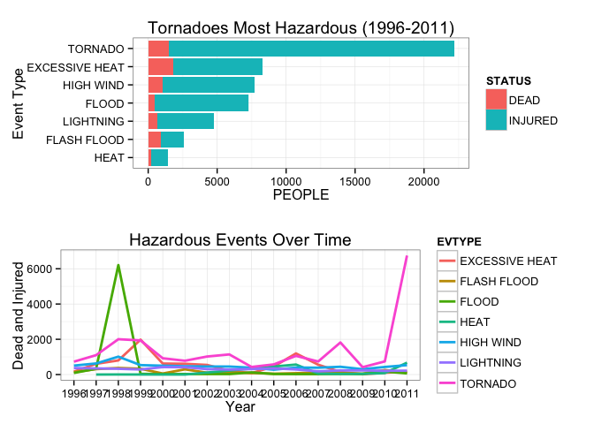

# Assessing Deadliest, Costliest Weather Events in America (1996-2011)

*Synopsis:* This assessment identifies the deadliest and costliest types of weather events that occured in the United States between 1996 and 2011. Tornadoes, followed by excessive heat and high wind, have been the most deadly in terms of the total number of deaths and injuries.  Floods have been the costliest in terms of aggregate monetary damage to property and crops, although tornadoes, hail, drought, and ice storms have caused significant economic loss in individual years.  The data for this study comes from the National Oceanic and Atmospheric Administration's (NOAA's) [Storm Events Database](http://www.ncdc.noaa.gov/stormevents/) and was conducted as part of a class assessment for the Johns Hopkins University's ["Reproducible Research"](https://www.coursera.org/course/repdata) offered through Coursera.

## DATA PROCESSING
The NOAA Storm Events Data was downloaded from the Coursera class website and then rows and columns pertaining to event type, population health, and economic consequences were loaded into R. The original data set was messy and necessitated a great deal of cleaning prior to analysis.  This section describes data cleaning decisions.


```r
library(R.utils) # contains bunzip2 package necessary for unpacking the NOAA data
```

```
## Loading required package: R.oo
## Loading required package: R.methodsS3
## R.methodsS3 v1.6.1 (2014-01-04) successfully loaded. See ?R.methodsS3 for help.
## R.oo v1.18.0 (2014-02-22) successfully loaded. See ?R.oo for help.
## 
## Attaching package: 'R.oo'
## 
## The following objects are masked from 'package:methods':
## 
##     getClasses, getMethods
## 
## The following objects are masked from 'package:base':
## 
##     attach, detach, gc, load, save
## 
## R.utils v1.34.0 (2014-10-07) successfully loaded. See ?R.utils for help.
## 
## Attaching package: 'R.utils'
## 
## The following object is masked from 'package:utils':
## 
##     timestamp
## 
## The following objects are masked from 'package:base':
## 
##     cat, commandArgs, getOption, inherits, isOpen, parse, warnings
```

```r
getData <- function(file, url) {
    # Gets file from web and unzips it into working directory
    found <- F
    if (file %in% dir()) {
        found <- T
    }
    if (!found) {
        download.file(url, "tmp.csv.bz2", method = "curl")
        bunzip2("tmp.csv.bz2", destname = file, overwrite = FALSE, remove=TRUE)
    }
}

getData("StormData.csv","https://d396qusza40orc.cloudfront.net/repdata%2Fdata%2FStormData.csv.bz2")
```

1) First, only columns pertaining to population health and economic consequences were read into R. These were determined by reading an initial row of the data and comparing column labels to the Storm Events Data [documentation](https://d396qusza40orc.cloudfront.net/repdata%2Fpeer2_doc%2Fpd01016005curr.pdf).

```r
stormTmp <- read.csv("StormData.csv",
                      header = TRUE, 
                      stringsAsFactors = FALSE,
                     nrows=1,
                     na.strings = "") # read in a test row

C <- sapply(stormTmp,class) # get classes and header names

toKeep <- c("BGN_DATE", # columns relevant to the analysis
            "BGN_TIME",
            "TIME_ZONE",
            "STATE",
            "EVTYPE",
            "FATALITIES",
            "INJURIES",
            "PROPDMG",
            "PROPDMGEXP",
            "CROPDMG",
            "CROPDMGEXP")
# Select just those columns that pertain to event type, population health, and economic consequences

for (i in 1:length(names(stormTmp))){
    if (!names(C)[i] %in% toKeep){
        C[i]<- "NULL" #replace class for non-desired columns with "NULL"
    } else if (C[[i]]=="integer"|C[[i]]=="logical"){
        C[i]<-"character" # original data has inconsistencies, better to treat as character
    }
}

# Read in the data set

storm <- read.csv("StormData.csv",
                     header = TRUE, 
                     stringsAsFactors = FALSE,
                     #nrows=100000,
                   colClasses = as.character(C),
                     na.strings = "")

print(object.size(storm),units="Mb")
```

```
## 77.1 Mb
```

2) Since this analysis investigated only those weather events that affected personal health or economics, all NOAA events without values in these fields were removed. This had the side benefit of reducing the size of the data in memory.

```r
storm <- storm[!(storm$FATALITIES == 0 & storm$INJURIES == 0)|
                     !(storm$PROPDMG == 0 & storm$CROPDMG==0),]
print(object.size(storm),units="Mb")
```

```
## 23.4 Mb
```

3) Next, several cleaning steps were taken to correct the multitude of inconsistencies inherent in NOAA's data -- most likely resulting from manual data entry processes.
* Per page 12 of NOAA's [documentation](https://d396qusza40orc.cloudfront.net/repdata%2Fpeer2_doc%2Fpd01016005curr.pdf), property and crop exponentiation fields should only contain B's for "billions", M's for "millions", and K's for "thousands." Since these fields would be necessary for assessing the costliest weather events -- a principle goal of this analysis -- the exponentiation values were standardized. A subsequent operation transformed these letters into their numeric equivalents for later calculation.


```r
whatToFind <- c("k","m","h")
    whatToReplace <- c("K","M","H")

for (item in whatToFind){
    if (item %in% unique(storm$PROPDMGEXP)){
        storm$PROPDMGEXP[grepl(item,storm$PROPDMGEXP)] <- whatToReplace[which(whatToFind == item)]
    }
}

for (item in whatToFind){
    if (item %in% unique(storm$CROPDMGEXP)){
        storm$CROPDMGEXP[grepl(item,storm$CROPDMGEXP)] <- whatToReplace[which(whatToFind == item)]
    }
}

storm$PROPMTPL <- 1; storm$CROPMTPL <- 1

storm$PROPMTPL[storm$PROPDMGEXP == "K"] <- 1000
storm$PROPMTPL[storm$PROPDMGEXP == "M"] <- 1000000
storm$PROPMTPL[storm$PROPDMGEXP == "H"] <-100
storm$CROPMTPL[storm$CROPDMGEXP == "K"] <- 1000
storm$CROPMTPL[storm$CROPDMGEXP == "M"] <- 1000000
storm$CROPMTPL[storm$CROPDMGEXP == "H"] <- 100
```

* Per page 6 of NOAA's [documentation](https://d396qusza40orc.cloudfront.net/repdata%2Fpeer2_doc%2Fpd01016005curr.pdf), there should be 34 unique event types. This analysis attempted to standardize the most common mistakes, though there are still inconsistencies.

```r
whatToFind2 <- c("TSTM WIND","THUNDERSTORMWINDS","TSTM WIND (G45)","THUNDERSTORM WINDSS","THUNDERSTORM","Tstm Wind","TSTMW",
                 "HIGH WINDS","WINDS","WIND",
                 "STRONG WINDS","GUSTY WINDS","Gusty Winds","GUSTY WIND","Strong Winds","Strong Wind",
                 "FLASH FLOODING", "FLOOD/FLASH FLOOD","FLASH FLOODS","FLASH FLOOD/FLOOD","FLASH FLOOD FROM ICE JAMS"," FLASH FLOOD",
                 "URBAN FLOOD", "URBAN/SML STREAM FLD", "RIVER FLOOD","FLOODING","RIVER FLOODING","River Flooding","URBAN/SMALL STREAM FLOOD","FLOODS"," FLOODS",
                 "HURRICANE","HURRICANE/TYPHOON","TYPHOON","HURRICANE OPAL","HURRICANE ERIN",
                 "TROPICAL STORM GORDON","TROPICAL STORM JERRY", "TROPICAL STORM DEAN", "TROPICAL STORM ALBERTO",
                 "WILD/FOREST FIRE","WILDFIRES","WILD FIRES"," WILD FIRES","LIGHTNING FIRE","FOREST FIRES","GRASS FIRES",
                 "RIP CURRENTS",
                 "WINTER WEATHER/MIX","HEAVY MIX","WINTER WEATHER MIX","WINTRY MIX",
                 "WINTER STORMS","SNOW","HEAVY RAIN/SNOW","HEAVY SNOW/WINTER STORM","SNOW AND ICE STORM","SNOW/HEAVY SNOW","SNOW FREEZING RAIN",
                 "HEAT WAVE","UNSEASONABLY WARM","UNSEASONABLY WARM AND DRY","RECORD/EXCESSIVE HEAT", "HEAT WAVE DROUGHT","HEAT WAVES","DROUGHT/EXCESSIVE HEAT","Heat Wave","RECORD HEAT",
                 "FOG",
                 "COLD","COLD AND SNOW","COLD WEATHER","Cold","COLD WAVE","HYPOTHERMIA/EXPOSURE","HYPERTHERMIA/EXPOSURE","HYPOTHERMIA","Cold Temperature","Extreme Cold","UNSEASONABLY COLD", "Extended Cold",
                 "TORNDAO","TORNADOES","TORNADO F3","TORNADO F2", "TORNADO F1","TORNADO F0",
                 "WATERSPOUT/TORNADO","WATERSPOUT/ TORNADO","WATERSPOUT-TORNADO","WATERSPOUT-","WATERSPOUT TORNADO",
                 "HAIL 0.75", "HAIL 075", "HAIL 100","HAIL 125","HAIL 150","HAIL 175", "HAIL 200", "HAIL 275", "HAIL 450", "HAIL 75", "HAIL DAMAGE", "HAILSTORM", "SMALL HAIL",
                 "HEAVY RAINS","HVY RAIN",
                 "ICE",
                 "HEAVY LAKE SNOW", "Lake Effect Snow",
                 "LIGHTNING WAUSEON")
whatToReplace2 <- c(rep("THUNDERSTORM WIND",times=7),
                    rep("HIGH WIND",3), 
                    rep("STRONG WIND",6),
                    rep("FLASH FLOOD",6), 
                    rep("FLOOD",9),
                    rep("HURRICANE (TYPHOON)",5),
                    rep("TROPICAL STORM",4),
                    rep("WILDFIRE",7),
                    rep("RIP CURRENT",1),
                    rep("WINTER WEATHER",4),
                    rep("WINTER STORM",7),
                    rep("EXCESSIVE HEAT",9),
                    rep("FREEZING FOG",1),
                    rep("COLD/WIND CHILL",12),
                    rep("TORNADO",6),
                    rep("WATERSPOUT",5),
                    rep("HAIL",13),
                    rep("HEAVY RAIN",2),
                    rep("ICE STORM",1),
                    rep("LAKE-EFFECT SNOW",2),
                    rep("LIGHTNING"))

for (item in whatToFind2){
    if (item %in% unique(storm$EVTYPE)){
        storm$EVTYPE[grepl(item,storm$EVTYPE)] <- whatToReplace2[which(whatToFind2 == item)]
    }
}
```

* The event data time codes needed to be adjusted for compatibility with R. Hours, minutes, and time zones were ignored for the purposes of this analysis, since the focus was on aggregate totals and yearly values would suffice.

```r
storm$BGN_DATE <- gsub(pattern = "\\s0{1}[:punct:]0{2}[:punct:]0{2}$","",storm$BGN_DATE)

storm$DATE <- strptime(storm$BGN_DATE,
                       format="%m/%d/%Y") #ignoring hour/time zone for this analysis
storm$DATE <- as.POSIXct(storm$DATE) # works better with charts
```

* In order to compare dollar amounts, it is necessary to convert values to today's dollars. This is accomplished by accessing Consumer Price Index data from the [Bureau of Labor Statistics](http://www.bls.gov/cpi/cpifact8.htm) and then calculating the rate of inflation.

```r
library(quantmod)
getSymbols('CPIAUCNS',src='FRED') # get consumer price index
```

```
##     As of 0.4-0, 'getSymbols' uses env=parent.frame() and
##  auto.assign=TRUE by default.
## 
##  This  behavior  will be  phased out in 0.5-0  when the call  will
##  default to use auto.assign=FALSE. getOption("getSymbols.env") and 
##  getOptions("getSymbols.auto.assign") are now checked for alternate defaults
## 
##  This message is shown once per session and may be disabled by setting 
##  options("getSymbols.warning4.0"=FALSE). See ?getSymbol for more details
```

```
## [1] "CPIAUCNS"
```

```r
todayCPI <- as.numeric(CPIAUCNS["2014-10"])
iRate <- as.numeric(CPIAUCNS[format(storm$DATE, "%Y-%m")])

storm$INFLATION <- 1.0+((todayCPI-iRate)/iRate) #calculate inflation adjustment rate
```

4) Finally, to facilitate analysis using the R package "dplyr", the data were loaded into a table data frame and economic losses in today's dollars calculated.

```r
library(dplyr)
```

```
## 
## Attaching package: 'dplyr'
## 
## The following objects are masked from 'package:xts':
## 
##     first, last
## 
## The following object is masked from 'package:stats':
## 
##     filter
## 
## The following objects are masked from 'package:base':
## 
##     intersect, setdiff, setequal, union
```

```r
library(tidyr)
```

```
## 
## Attaching package: 'tidyr'
## 
## The following object is masked from 'package:R.utils':
## 
##     extract
```

```r
storm1 <- tbl_df(storm)
storm1 <-
    storm1 %>%
    select(DATE, EVTYPE, FATALITIES, INJURIES, PROPDMG, PROPMTPL, CROPDMG, CROPMTPL, INFLATION) %>%
    mutate(PROPTOTAL = PROPDMG * PROPMTPL * INFLATION, 
           CROPTOTAL = CROPDMG*CROPMTPL*INFLATION,
           YEAR = format(DATE,"%Y")) %>%
    select(YEAR, EVTYPE, FATALITIES, INJURIES, PROPTOTAL, CROPTOTAL)
```

##RESULTS

The most deadly weather events were determined by examining the total number of dead and injured from 1996 to 2011. Earlier events were discarded, because NOAA did not reliably record all event types prior 1996, according to visual inspection of the plotted event types over time. 

* Tornadoes, followed by excessive heat and high wind, have been the most deadly in terms of the total number of deaths and injuries. Excessive heat, however, has caused more deaths than tornadoes.


```r
result2 <-
    storm1 %>%
    select(YEAR, EVTYPE, FATALITIES, INJURIES) %>%
    group_by(YEAR, EVTYPE) %>%
    summarize(DEAD = sum(FATALITIES),
              INJURED = sum(INJURIES),
              deadAndInjured = DEAD+INJURED) %>%
    arrange(desc(deadAndInjured))

deadliest <-
    storm1 %>%
    select(EVTYPE,FATALITIES,INJURIES) %>%
    group_by(EVTYPE) %>%
    summarize(deadAndInjured = sum(FATALITIES)+sum(INJURIES)) %>%
    arrange(desc(deadAndInjured))

deadliest <- deadliest$EVTYPE[1:7] # find the top seven deadliest event types

result2 <- filter(result2, EVTYPE %in% deadliest & YEAR >1995)

result2 <-
    result2 %>%
    select(YEAR, EVTYPE, DEAD, INJURED) %>%
    gather(STATUS, PEOPLE, DEAD:INJURED) # gather dead and injured into one column

library(ggplot2)
library(gridExtra)
```

```
## Loading required package: grid
```

```r
x <-ggplot(result2,aes(x=YEAR,y=PEOPLE,group=EVTYPE,color=EVTYPE))+
    geom_line(stat="summary",fun.y="sum",size=1)+
    labs(x="Year",y="Dead and Injured")+
    labs(title="Deadliest Events Over Time")+
    theme_bw()

y <- ggplot(result2, aes(x=reorder(EVTYPE,PEOPLE), y= PEOPLE,fill=STATUS))+
    geom_bar(stat="identity")+ 
    coord_flip()+
    labs(x="Event Type", y = "PEOPLE")+
    labs(title = "Tornadoes Most Deadly (1996-2011)")+
    theme_bw() 

grid.arrange(y, x, nrow=2)
```

 

* Floods have been the costliest in terms of aggregate monetary damage to property and crops, although tornadoes, hail, drought, and ice storms have caused significant economic loss in individual years.


```r
result <- 
    storm1 %>%
    select(YEAR, EVTYPE, PROPTOTAL, CROPTOTAL) %>%
    group_by(YEAR,EVTYPE) %>%
    summarize(PROPERTY = sum(PROPTOTAL),
              CROPS = sum(CROPTOTAL),
              economicLoss = PROPERTY + CROPS) %>%
    arrange(desc(economicLoss))

costliest <-
    storm1 %>%
    select(EVTYPE, PROPTOTAL, CROPTOTAL) %>%
    group_by(EVTYPE) %>%
    summarize(economicLoss = sum(PROPTOTAL)+sum(CROPTOTAL))%>%
    arrange(desc(economicLoss))

costliest <- costliest$EVTYPE[1:7]

result <- filter(result, EVTYPE %in% costliest & YEAR > 1995)

result <-
    result %>%
    select(YEAR, EVTYPE, PROPERTY, CROPS) %>%
    gather(DAMAGE, VALUE, PROPERTY:CROPS) # gather economic losses into one column

g <-ggplot(result,aes(x=YEAR,y=VALUE/1000000000,group=EVTYPE,color=EVTYPE))+
    geom_line(stat="summary",fun.y="sum",size=1)+
    labs(x="Year",y="Billions of Today's Dollars")+
    labs(title="Costliest Events Over Time")+
    theme_bw()

z <- ggplot(result, aes(x=reorder(EVTYPE,VALUE), y= VALUE/1000000000,fill=DAMAGE))+
    geom_bar(stat="identity")+ 
    coord_flip()+
    labs(x="Event Type", y = "Billions of Today's Dollars")+
    labs(title = "Floods Most Costly (1996-2011)")+
    theme_bw() 

grid.arrange(z, g, nrow=2)
```

 
